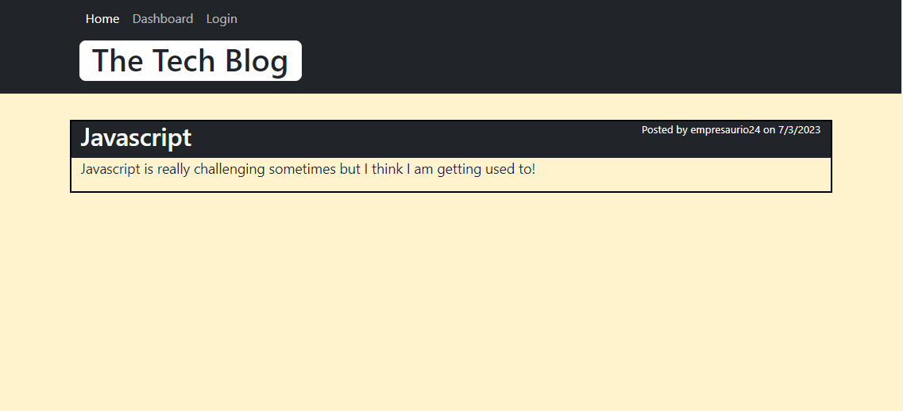

# Tech Blog

This is a tech blog web application built with Express.js, Sequelize, MySQL, and Handlebars. It provides users with features such as user authentication, user registration, creating and deleting posts, adding comments, and password encryption using bcrypt.

## Features

- User authentication: Users can log in to the application using their credentials. Sessions and cookies are used to maintain the user's authentication state.
- User registration: New users can sign up and create an account in the application. The passwords are encrypted using bcrypt for added security.
- Create and delete posts: Authenticated users can create new blog posts and delete their own posts if needed.
- Add comments: Users can leave comments on blog posts to engage in discussions.

## Technologies Used

The following technologies were used to develop this application:

- Node.js: A JavaScript runtime environment.
- Express.js: A web application framework for Node.js.
- Sequelize: An ORM (Object-Relational Mapping) for Node.js, used to interact with the MySQL database.
- MySQL: A popular open-source relational database management system.
- Handlebars: A templating engine for Node.js, used for rendering views and generating dynamic HTML.
- Bcrypt: A library used to hash and encrypt passwords for secure storage.

## Usage

To use the tech blog online all you have to do is visit this link 

https://shielded-dawn-21497-41f00b0f5c87.herokuapp.com/

otherwise clone the repository, run npm i to install all the dependencies and run the seeds. 

## Licence

This repository is licenced under the MIT licence. 
